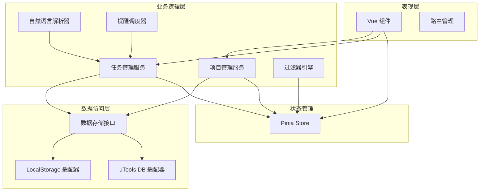

# 设计文档

## 概述

本设计文档描述了 uTools 待办事项插件的技术架构和实现方案。该插件是一个功能完善的任务管理工具，支持项目分组、子任务、重复任务、提醒通知等高级功能。

### 设计目标

- 提供直观易用的任务管理界面
- 支持高级任务组织功能（项目、标签、子任务）
- 实现可靠的数据持久化和同步
- 确保良好的性能和响应速度
- 支持自然语言快速输入
- 提供丰富的视图和过滤选项

### 技术栈

- **前端框架**: Vue 3 (Composition API)
- **状态管理**: Pinia
- **类型系统**: TypeScript
- **构建工具**: Vite
- **UI 组件**: 自定义组件库
- **数据存储**: uTools DB API / localStorage (降级)
- **通知系统**: uTools Notification API

## 架构

### 整体架构

应用采用分层架构设计，从上到下分为：

1. **表现层 (Presentation Layer)**: Vue 组件，负责 UI 渲染和用户交互
2. **业务逻辑层 (Business Logic Layer)**: Composables 和服务类，处理业务规则
3. **数据访问层 (Data Access Layer)**: 数据存储接口，负责数据持久化
4. **工具层 (Utility Layer)**: 通用工具函数和辅助类



### 架构原则

- **关注点分离**: UI 组件只负责渲染，业务逻辑封装在服务层
- **单一职责**: 每个模块和类只负责一个明确的功能
- **依赖注入**: 通过接口而非具体实现进行依赖
- **可测试性**: 业务逻辑与框架解耦，便于单元测试
- **可扩展性**: 使用插件化设计，便于添加新功能

## 组件和接口

### 核心组件

#### 1. TaskManager (任务管理器)

负责任务的 CRUD 操作和业务规则。

```typescript
interface TaskManager {
  // 创建任务
  createTask(task: CreateTaskDTO): Promise<Task>
  
  // 更新任务
  updateTask(id: string, updates: Partial<Task>): Promise<Task>
  
  // 删除任务
  deleteTask(id: string, confirmed?: boolean): Promise<void>
  
  // 切换完成状态
  toggleTaskComplete(id: string): Promise<Task>
  
  // 添加子任务
  addSubtask(parentId: string, subtask: CreateTaskDTO): Promise<Task>
  
  // 获取任务
  getTask(id: string): Promise<Task | null>
  
  // 获取所有任务
  getAllTasks(): Promise<Task[]>
  
  // 处理重复任务
  handleRecurringTask(task: Task): Promise<Task | null>
}
```

#### 2. ProjectManager (项目管理器)

负责项目的管理和任务分组。

```typescript
interface ProjectManager {
  // 创建项目
  createProject(project: CreateProjectDTO): Promise<Project>
  
  // 更新项目
  updateProject(id: string, updates: Partial<Project>): Promise<Project>
  
  // 删除项目
  deleteProject(id: string): Promise<void>
  
  // 获取项目
  getProject(id: string): Promise<Project | null>
  
  // 获取所有项目
  getAllProjects(): Promise<Project[]>
  
  // 获取项目的任务数量
  getProjectTaskCount(id: string): Promise<number>
  
  // 移动任务到项目
  moveTaskToProject(taskId: string, projectId: string): Promise<void>
}
```

#### 3. NaturalLanguageParser (自然语言解析器)

解析用户输入的自然语言文本，提取任务属性。

```typescript
interface NaturalLanguageParser {
  // 解析输入文本
  parse(input: string): ParseResult
}

interface ParseResult {
  // 清理后的任务标题
  title: string
  
  // 提取的截止日期
  dueDate?: Date
  
  // 提取的标签
  tags: string[]
  
  // 提取的优先级
  priority?: Priority
  
  // 提取的项目名称
  projectName?: string
}
```

#### 4. ReminderScheduler (提醒调度器)

管理任务提醒的调度和触发。

```typescript
interface ReminderScheduler {
  // 调度提醒
  scheduleReminder(taskId: string, reminderTime: Date): Promise<void>
  
  // 取消提醒
  cancelReminder(taskId: string, reminderTime: Date): Promise<void>
  
  // 取消任务的所有提醒
  cancelAllReminders(taskId: string): Promise<void>
  
  // 触发提醒
  triggerReminder(taskId: string): Promise<void>
  
  // 检查待触发的提醒
  checkPendingReminders(): Promise<void>
}
```

#### 5. FilterEngine (过滤引擎)

根据条件过滤和排序任务。

```typescript
interface FilterEngine {
  // 应用过滤器
  applyFilter(tasks: Task[], filter: TaskFilter): Task[]
  
  // 应用排序
  applySort(tasks: Task[], sortBy: SortOption): Task[]
  
  // 获取预定义视图
  getViewTasks(view: ViewType, tasks: Task[]): Task[]
}

interface TaskFilter {
  projectId?: string
  tags?: string[]
  priority?: Priority[]
  completed?: boolean
  dueDateRange?: { start?: Date; end?: Date }
}

type SortOption = 'createdAt' | 'dueDate' | 'priority' | 'title'
type ViewType = 'today' | 'upcoming' | 'inbox' | 'all'
```

#### 6. DataStore (数据存储)

提供统一的数据持久化接口。

```typescript
interface DataStore {
  // 初始化存储
  initialize(): Promise<void>
  
  // 保存任务
  saveTasks(tasks: Task[]): Promise<void>
  
  // 加载任务
  loadTasks(): Promise<Task[]>
  
  // 保存项目
  saveProjects(projects: Project[]): Promise<void>
  
  // 加载项目
  loadProjects(): Promise<Project[]>
  
  // 保存标签
  saveTags(tags: Tag[]): Promise<void>
  
  // 加载标签
  loadTags(): Promise<Tag[]>
  
  // 保存设置
  saveSettings(settings: AppSettings): Promise<void>
  
  // 加载设置
  loadSettings(): Promise<AppSettings>
  
  // 导出数据
  exportData(): Promise<ExportData>
  
  // 导入数据
  importData(data: ExportData, strategy: ImportStrategy): Promise<void>
}

type ImportStrategy = 'overwrite' | 'merge' | 'skip'
```

### Vue 组件结构

```
src/
├── components/
│   ├── task/
│   │   ├── TaskList.vue          # 任务列表
│   │   ├── TaskItem.vue          # 任务项
│   │   ├── TaskEditor.vue        # 任务编辑器
│   │   ├── TaskInput.vue         # 任务输入框
│   │   └── SubtaskList.vue       # 子任务列表
│   ├── project/
│   │   ├── ProjectList.vue       # 项目列表
│   │   ├── ProjectItem.vue       # 项目项
│   │   └── ProjectEditor.vue     # 项目编辑器
│   ├── filter/
│   │   ├── ViewSelector.vue      # 视图选择器
│   │   ├── FilterPanel.vue       # 过滤面板
│   │   └── SortSelector.vue      # 排序选择器
│   ├── stats/
│   │   ├── StatsPanel.vue        # 统计面板
│   │   └── TrendChart.vue        # 趋势图表
│   ├── common/
│   │   ├── Modal.vue             # 模态框
│   │   ├── Dropdown.vue          # 下拉菜单
│   │   ├── DatePicker.vue        # 日期选择器
│   │   ├── TagInput.vue          # 标签输入
│   │   └── Toast.vue             # 提示消息
│   └── settings/
│       └── SettingsPanel.vue     # 设置面板
├── composables/
│   ├── useTasks.ts               # 任务管理 hook
│   ├── useProjects.ts            # 项目管理 hook
│   ├── useFilters.ts             # 过滤器 hook
│   ├── useSearch.ts              # 搜索 hook
│   ├── useKeyboard.ts            # 键盘快捷键 hook
│   └── useTheme.ts               # 主题管理 hook
├── stores/
│   ├── taskStore.ts              # 任务状态
│   ├── projectStore.ts           # 项目状态
│   ├── uiStore.ts                # UI 状态
│   └── settingsStore.ts          # 设置状态
├── services/
│   ├── TaskManager.ts
│   ├── ProjectManager.ts
│   ├── NaturalLanguageParser.ts
│   ├── ReminderScheduler.ts
│   ├── FilterEngine.ts
│   └── DataStore.ts
└── utils/
    ├── date.ts                   # 日期工具
    ├── validation.ts             # 验证工具
    └── storage.ts                # 存储工具
```

## 数据模型

### Task (任务)

```typescript
interface Task {
  // 唯一标识符
  id: string
  
  // 任务标题
  title: string
  
  // 任务备注
  notes?: string
  
  // 所属项目 ID
  projectId: string
  
  // 父任务 ID（用于子任务）
  parentId?: string
  
  // 优先级
  priority: Priority
  
  // 标签
  tags: string[]
  
  // 截止日期
  dueDate?: Date
  
  // 提醒时间列表
  reminders: Date[]
  
  // 重复规则
  recurrence?: RecurrenceRule
  
  // 完成状态
  completed: boolean
  
  // 完成时间
  completedAt?: Date
  
  // 创建时间
  createdAt: Date
  
  // 最后修改时间
  updatedAt: Date
  
  // 排序顺序
  order: number
}

type Priority = 'high' | 'medium' | 'low' | 'none'
```

### Project (项目)

```typescript
interface Project {
  // 唯一标识符
  id: string
  
  // 项目名称
  name: string
  
  // 项目颜色
  color: string
  
  // 是否为默认项目（收件箱）
  isDefault: boolean
  
  // 创建时间
  createdAt: Date
  
  // 排序顺序
  order: number
}
```

### Tag (标签)

```typescript
interface Tag {
  // 标签名称（唯一）
  name: string
  
  // 标签颜色
  color: string
  
  // 使用次数
  usageCount: number
}
```

### RecurrenceRule (重复规则)

```typescript
interface RecurrenceRule {
  // 重复频率
  frequency: RecurrenceFrequency
  
  // 间隔（每 N 天/周/月/年）
  interval: number
  
  // 每周的哪几天（仅当 frequency 为 weekly 时）
  daysOfWeek?: number[]  // 0-6, 0 为周日
  
  // 每月的第几天（仅当 frequency 为 monthly 时）
  dayOfMonth?: number    // 1-31
  
  // 每月的第几个星期几（仅当 frequency 为 monthly 时）
  weekOfMonth?: { week: number; day: number }  // week: 1-5, day: 0-6
  
  // 结束日期
  endDate?: Date
  
  // 重复次数限制
  count?: number
}

type RecurrenceFrequency = 'daily' | 'weekly' | 'monthly' | 'yearly' | 'custom'
```

### AppSettings (应用设置)

```typescript
interface AppSettings {
  // 默认视图
  defaultView: ViewType
  
  // 默认排序方式
  defaultSort: SortOption
  
  // 主题模式
  themeMode: 'auto' | 'light' | 'dark'
  
  // 是否启用提醒
  enableReminders: boolean
  
  // 是否自动删除已完成任务
  autoDeleteCompleted: boolean
  
  // 自动删除延迟天数
  autoDeleteDelay: number
  
  // 是否播放完成音效
  playCompletionSound: boolean
  
  // 每周第一天
  weekStartsOn: 0 | 1  // 0: 周日, 1: 周一
  
  // 是否启用动画
  enableAnimations: boolean
}
```

### ExportData (导出数据)

```typescript
interface ExportData {
  // 数据格式版本
  version: string
  
  // 导出时间
  exportedAt: Date
  
  // 任务列表
  tasks: Task[]
  
  // 项目列表
  projects: Project[]
  
  // 标签列表
  tags: Tag[]
  
  // 设置
  settings: AppSettings
}
```

### DTO 类型

```typescript
// 创建任务 DTO
interface CreateTaskDTO {
  title: string
  notes?: string
  projectId?: string
  parentId?: string
  priority?: Priority
  tags?: string[]
  dueDate?: Date
  reminders?: Date[]
  recurrence?: RecurrenceRule
}

// 创建项目 DTO
interface CreateProjectDTO {
  name: string
  color?: string
}
```


## 正确性属性

*属性是一个特征或行为,应该在系统的所有有效执行中保持为真——本质上是关于系统应该做什么的正式陈述。属性作为人类可读规范和机器可验证正确性保证之间的桥梁。*

